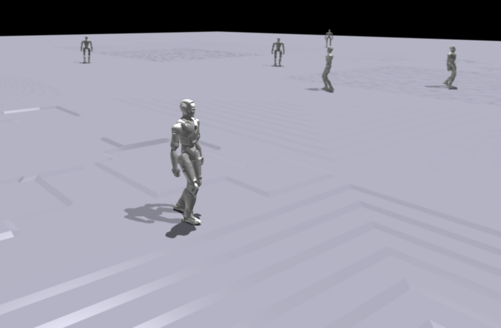

# EngineAI RL Workspace

**EngineAI RL Workspace** is a versatile and universal RL framework for legged robots, including environment, training and eval for RL algorithms. It empowers seamless development and evaluation of RL algorithms for legged robots with modular design, extensibility, and comprehensive tools.

**Maintainer**: Darrell

**Affiliation**: Shenzhen EngineAI Robotics Technology Co., Ltd.

**Contact**: info@engineai.com.cn
## Key Features
### Easy to develop
#### Modular design
  Divided into individual modules, not only ensures readability, but also ensures that editing a single module will not affect other modules
- Env Obs, Domain Rands, Goals, Rewards
- Algo Runners, Algos, Networks, Storage
#### Simplification
  - Train and play are controlled by the same runner logic and do not need to be written repeatedly
  - Various modules can inherit according to the needs of exp, reducing repetitive writing
  - Algo's change does not require changing Env, only changing the way output is received from Env
### Comprehensive tools
#### Record Runs
 - Record videos of training or playing
 - Custom Env variables and record play data to facilitate Run comparison under controlled variables
 - Save the code file during training for easy comparison between runs
#### Track and Reproduce Runs
 - Automatically restore saved code files during resume and play, avoiding the tedious process of searching for corresponding versions
 - Save git info
#### Create Runs from json
 - Save the `.json` file for recording parameters and have a built-in tool to convert it to a `.py` file, which is convenient for modification according to a certain run
#### Format conversion
 - Convert `.pt` files to `.onnx` and `.mnn`
## Getting Started ##
Our [documentation page](https://dx3a2bminsq.feishu.cn/wiki/BFfwwMaAcisCQ2kyquZclIrgnkg) provides everything you need to get started, including detailed tutorials and step-by-step guides. Follow these links to learn more about:

- [Installation](https://dx3a2bminsq.feishu.cn/wiki/KWmYwQlOuiGlYMk4Fp7ch8x8ndh)
- [Framework Structure](https://dx3a2bminsq.feishu.cn/wiki/PLdIwi2sbihp7ykZok8cVqFsnKg)
- [Tutorials](https://dx3a2bminsq.feishu.cn/wiki/EduJwoPPfi5gAwkJ1kHcfZD7nlg)
- [Development Guide](https://dx3a2bminsq.feishu.cn/wiki/R0JqwPe9miRb0bkSUfKcv40Tnae)

## Troubleshooting
Please see the [troubleshooting](https://dx3a2bminsq.feishu.cn/wiki/Yj5Dw9rQWiGXNgkeb2pccQTSnBf) section.

## Support

* Please use GitHub [Discussions](https://github.com/engineai-robotics/engineai_rl_workspace/discussions) for discussing ideas, asking questions, and requests for new features.
* Github [Issues](https://github.com/engineai-robotics/engineai_rl_workspace/issues) should only be used to track executable pieces of work with a definite scope and a clear deliverable. These can be fixing bugs, documentation issues, new features, or general updates.

## License

EngineAI RL Workspace is released under [BSD-3 License](LICENSE).

## Acknowledgement
This repository is built upon the support and contributions of the following open-source projects. Special thanks to:

- [legged_gym](https://github.com/leggedrobotics/legged_gym): The foundation for training and running codes.
- [humanoid_gym](https://github.com/roboterax/humanoid-gym): The reward and terrain generation code in this project is inspired by the humanoid_gym library. 
- [rsl_rl](https://github.com/leggedrobotics/rsl_rl.git): Reinforcement learning algorithm implementation.
- [AMP_for_hardware](https://github.com/Alescontrela/AMP_for_hardware): The AMP (Adversarial Motion Priors) algorithm implementation.
---
